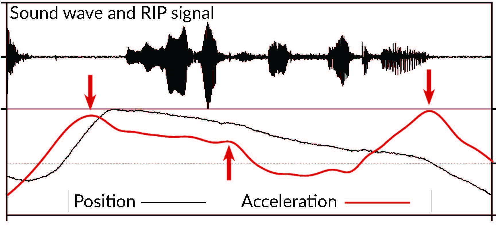

# TEMPOS

Short introduction text here.

---

## Work Packages

### W1-breath-timing: Co-dependency of breathing cycle and syllable strength

Short description.

### W2-posture-rhythm: Posture stability during strong/weak syllables

Short description.

### W3-body-sound: Articulatory-acoustic mapping for explainable speech technology

Short description.

---

## News

- July 2026: Project started
- 22-23 July 2026: EMA workshop in Bielefeld
